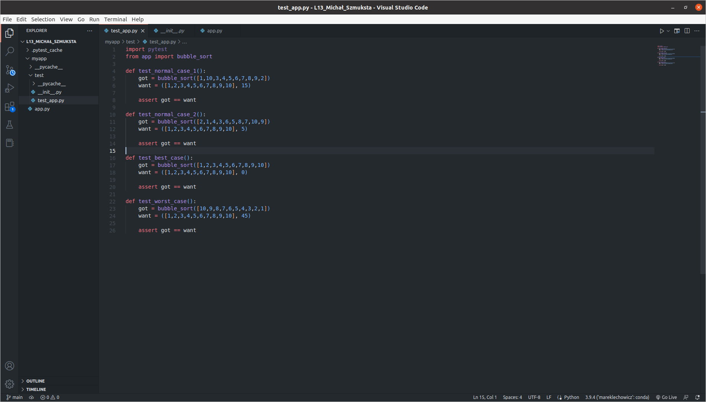
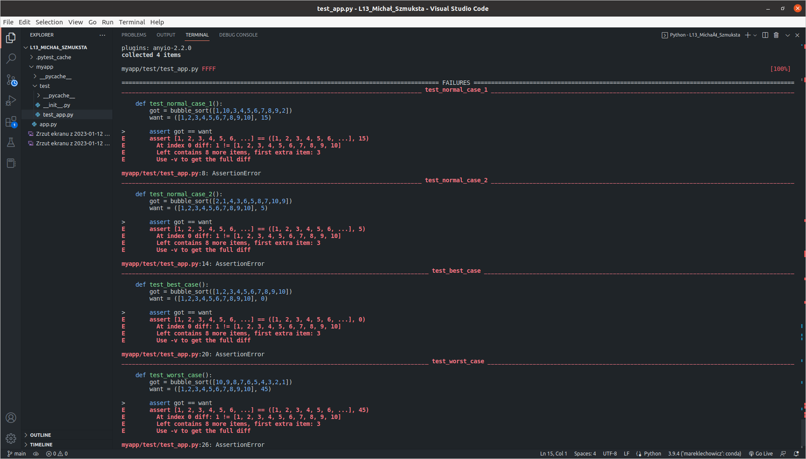
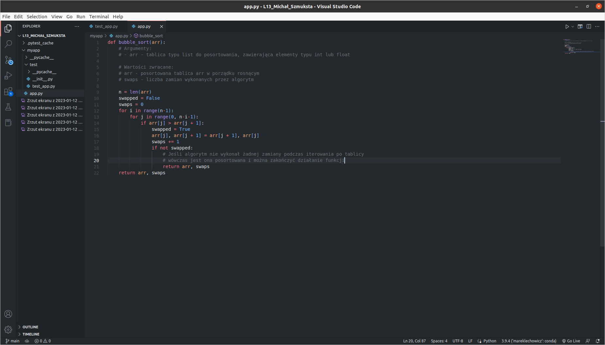

# Faza Zielona
W fazie zielonej napisano cztery testy mające na celu zbadanie poporawności działania algorytmu sortowania bąbelkowego:

Następnie zaimplementowano sam algorytm:

W ostatnim kroku w tej fazie uruchomiono testy, które pokazały, że algorytm działa niepoprawnie z względu na ilość zwracanych elementów:

# Faza Czerwona
Po analizie kodu okazało się, że zaimplementowany algorytm nie zwracał liczby zamian podczas sortowania. Dodano tą funkcjonalność:

Następnie ponownie uruchomiono testy, które tym razem pokazały, że algorytm działa poprawnie:

# Faza Refactor
Do działającego poprawnie algorytmu dodano dodatkowy warunek przyspieszający jego działanie i dodatkowe komentarze:

