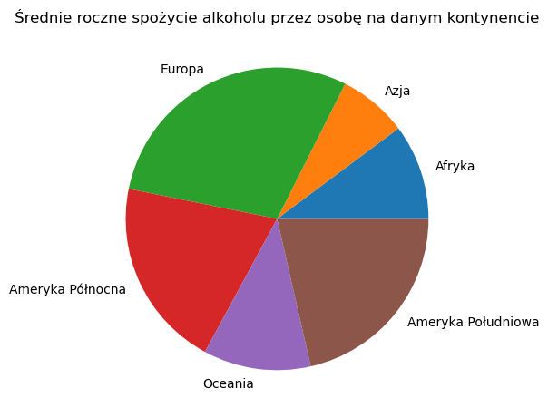
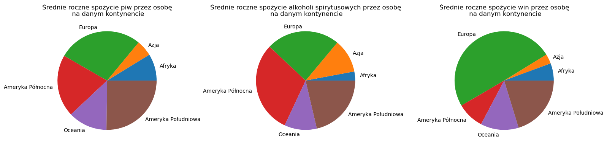
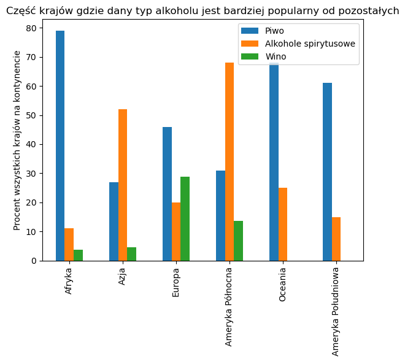

# **Laboratorium 5**
Michał Szmuksta, gr. 7, czwartek 10:00

#### **Wstęp**
Celem laboratorium było zapoznanie się z protokołem TIER 3.0 oraz zasadami Tidy Data. Poniższy skrypt miał na celu analizę przetworzonych już danych zawartych w katalogu Analysis Data. Poniżej zaimportowano niezbędne biblioteki. W analizie danych skorzystano z biblioteki pandasql w celu wykorzystania umiejętności nabytych podczas poprzednich laboratoriów.


```python
import pandas as pd
from pandasql import sqldf
import matplotlib.pyplot as plt
```

W poniższej komórce wczytano uporządkowany zbiór danych.


```python
Drinks = pd.read_csv("../Analysis Data/drinks_final.csv")
Drinks
d = sqldf("Select * from Drinks where continent = 'South America' AND beer_servings > wine_servings AND beer_servings > spirit_servings")
d

```


<div>
<style scoped>
    .dataframe tbody tr th:only-of-type {
        vertical-align: middle;
    }

    .dataframe tbody tr th {
        vertical-align: top;
    }

    .dataframe thead th {
        text-align: right;
    }
</style>
<table border="1" class="dataframe">
  <thead>
    <tr style="text-align: right;">
      <th></th>
      <th>country</th>
      <th>continent</th>
      <th>beer_servings</th>
      <th>spirit_servings</th>
      <th>wine_servings</th>
      <th>total_litres_of_pure_alcohol</th>
    </tr>
  </thead>
  <tbody>
    <tr>
      <th>0</th>
      <td>Bolivia</td>
      <td>South America</td>
      <td>167</td>
      <td>41</td>
      <td>8</td>
      <td>3.8</td>
    </tr>
    <tr>
      <th>1</th>
      <td>Brazil</td>
      <td>South America</td>
      <td>245</td>
      <td>145</td>
      <td>16</td>
      <td>7.2</td>
    </tr>
    <tr>
      <th>2</th>
      <td>Colombia</td>
      <td>South America</td>
      <td>159</td>
      <td>76</td>
      <td>3</td>
      <td>4.2</td>
    </tr>
    <tr>
      <th>3</th>
      <td>Ecuador</td>
      <td>South America</td>
      <td>162</td>
      <td>74</td>
      <td>3</td>
      <td>4.2</td>
    </tr>
    <tr>
      <th>4</th>
      <td>Paraguay</td>
      <td>South America</td>
      <td>213</td>
      <td>117</td>
      <td>74</td>
      <td>7.3</td>
    </tr>
    <tr>
      <th>5</th>
      <td>Peru</td>
      <td>South America</td>
      <td>163</td>
      <td>160</td>
      <td>21</td>
      <td>6.1</td>
    </tr>
    <tr>
      <th>6</th>
      <td>Trinidad &amp; Tobago</td>
      <td>South America</td>
      <td>197</td>
      <td>156</td>
      <td>7</td>
      <td>6.4</td>
    </tr>
    <tr>
      <th>7</th>
      <td>Venezuela</td>
      <td>South America</td>
      <td>333</td>
      <td>100</td>
      <td>3</td>
      <td>7.7</td>
    </tr>
  </tbody>
</table>
</div>


#### **Analiza danych**
##### **1. Statystyki związane z średnią**
Poniżej przedstawiono statystyki dotyczące średniego spożycie alkoholi na świecie w zależności od kontynentu.


```python
Df = sqldf("SELECT continent, AVG(beer_servings), AVG(spirit_servings), AVG(wine_servings), AVG(total_litres_of_pure_alcohol) FROM Drinks "
           "GROUP BY continent")
Df
```


<div>
<style scoped>
    .dataframe tbody tr th:only-of-type {
        vertical-align: middle;
    }

    .dataframe tbody tr th {
        vertical-align: top;
    }

    .dataframe thead th {
        text-align: right;
    }
</style>
<table border="1" class="dataframe">
  <thead>
    <tr style="text-align: right;">
      <th></th>
      <th>continent</th>
      <th>AVG(beer_servings)</th>
      <th>AVG(spirit_servings)</th>
      <th>AVG(wine_servings)</th>
      <th>AVG(total_litres_of_pure_alcohol)</th>
    </tr>
  </thead>
  <tbody>
    <tr>
      <th>0</th>
      <td>Africa</td>
      <td>61.471698</td>
      <td>16.339623</td>
      <td>16.264151</td>
      <td>3.007547</td>
    </tr>
    <tr>
      <th>1</th>
      <td>Asia</td>
      <td>37.045455</td>
      <td>60.840909</td>
      <td>9.068182</td>
      <td>2.170455</td>
    </tr>
    <tr>
      <th>2</th>
      <td>Europe</td>
      <td>193.777778</td>
      <td>132.555556</td>
      <td>142.222222</td>
      <td>8.617778</td>
    </tr>
    <tr>
      <th>3</th>
      <td>North America</td>
      <td>143.090909</td>
      <td>166.181818</td>
      <td>25.318182</td>
      <td>5.977273</td>
    </tr>
    <tr>
      <th>4</th>
      <td>Oceania</td>
      <td>89.687500</td>
      <td>58.437500</td>
      <td>35.625000</td>
      <td>3.381250</td>
    </tr>
    <tr>
      <th>5</th>
      <td>South America</td>
      <td>176.769231</td>
      <td>117.923077</td>
      <td>58.153846</td>
      <td>6.315385</td>
    </tr>
  </tbody>
</table>
</div>


```python
fig, ax = plt.subplots(figsize=(6, 6))
Df.plot.pie(ax=ax, y='AVG(total_litres_of_pure_alcohol)', labels=['Afryka','Azja','Europa','Ameryka Północna','Oceania','Ameryka Południowa'])
ax.set_title('Średnie roczne spożycie alkoholu przez osobę na danym kontynencie')
ax.get_legend().remove()
ax.set_ylabel('')
plt.tight_layout()
plt.show()
```


    

    


Można zauważyć, że średnio najwięcej alkoholu spożywa Europejczyk, za to średnio najmniej alkoholu spożywa Azjata. Osoba żyjąca w Ameryce Północnej spożywa mniej więcej podobną ilość alkoholu co ta żyjąca w Ameryce Południowej. Poniżej przedstawiono bardziej szczegółowe statystyki z podziałem na rodzaj spożywanego alkoholu.


```python
fig, ax = plt.subplots(1,3, figsize=(16, 6))
Df.plot.pie(ax=ax[0], y='AVG(beer_servings)', labels=['Afryka','Azja','Europa','Ameryka Północna','Oceania','Ameryka Południowa'])
ax[0].set_title('Średnie roczne spożycie piw przez osobę\n na danym kontynencie')
ax[0].get_legend().remove()
ax[0].set_ylabel('')
plt.tight_layout()
Df.plot.pie(ax=ax[1], y='AVG(spirit_servings)', labels=['Afryka','Azja','Europa','Ameryka Północna','Oceania','Ameryka Południowa'])
ax[1].set_title('Średnie roczne spożycie alkoholi spirytusowych przez osobę\n na danym kontynencie')
ax[1].get_legend().remove()
ax[1].set_ylabel('')
plt.tight_layout()
Df.plot.pie(ax=ax[2], y='AVG(wine_servings)', labels=['Afryka','Azja','Europa','Ameryka Północna','Oceania','Ameryka Południowa'])
ax[2].set_title('Średnie roczne spożycie win przez osobę\n na danym kontynencie')
ax[2].get_legend().remove()
ax[2].set_ylabel('')
plt.tight_layout()
plt.show()
```


    

    


Co ciekawe można zauważyć, że Europa góruje w aż dwóch typach spożywanego alkoholu, a mianowicie - piwa i wina. Może być to spowodowane rozwiniętą tradycją winiarską oraz browarniczą na starym kontynencie. Przeciętny Europejczyk spożywa tyle samo wina co suma osób żyjących na pozostałych kontynentach. Osoba żyjące w Ameryce Południowej oraz Oceanii średnio wybiera po równo z każdego typu alkoholu, z lekką przewagą piwa. Natomiast osoby żyjące w Ameryce Północnej chętniej sięgają po mocniejsze rodzaje alkoholu, podobnie jak Azjaci.

##### **2. Statystyki związane z wartościami maksymalnymi i minimalnymi**
Poniżej przedstawiono 5 krajów z największym rocznym spożyciem alkoholu na osobę:


```python
Df = sqldf("SELECT country, continent, total_litres_of_pure_alcohol FROM Drinks ORDER BY total_litres_of_pure_alcohol DESC LIMIT 5")
Df
```


<div>
<style scoped>
    .dataframe tbody tr th:only-of-type {
        vertical-align: middle;
    }

    .dataframe tbody tr th {
        vertical-align: top;
    }

    .dataframe thead th {
        text-align: right;
    }
</style>
<table border="1" class="dataframe">
  <thead>
    <tr style="text-align: right;">
      <th></th>
      <th>country</th>
      <th>continent</th>
      <th>total_litres_of_pure_alcohol</th>
    </tr>
  </thead>
  <tbody>
    <tr>
      <th>0</th>
      <td>Belarus</td>
      <td>Europe</td>
      <td>14.4</td>
    </tr>
    <tr>
      <th>1</th>
      <td>Lithuania</td>
      <td>Europe</td>
      <td>12.9</td>
    </tr>
    <tr>
      <th>2</th>
      <td>Andorra</td>
      <td>Europe</td>
      <td>12.4</td>
    </tr>
    <tr>
      <th>3</th>
      <td>Grenada</td>
      <td>North America</td>
      <td>11.9</td>
    </tr>
    <tr>
      <th>4</th>
      <td>Czech Republic</td>
      <td>Europe</td>
      <td>11.8</td>
    </tr>
  </tbody>
</table>
</div>


Aż trzy z krajów z największym spożyciem alkoholu na osobę znajdują się w Europie.

Poniżej przedstawiono 5 krajów z największym rocznym spożyciem piw na osobę:


```python
Df = sqldf("SELECT country, continent, beer_servings FROM Drinks ORDER BY beer_servings DESC LIMIT 5")
Df
```


<div>
<style scoped>
    .dataframe tbody tr th:only-of-type {
        vertical-align: middle;
    }

    .dataframe tbody tr th {
        vertical-align: top;
    }

    .dataframe thead th {
        text-align: right;
    }
</style>
<table border="1" class="dataframe">
  <thead>
    <tr style="text-align: right;">
      <th></th>
      <th>country</th>
      <th>continent</th>
      <th>beer_servings</th>
    </tr>
  </thead>
  <tbody>
    <tr>
      <th>0</th>
      <td>Namibia</td>
      <td>Africa</td>
      <td>376</td>
    </tr>
    <tr>
      <th>1</th>
      <td>Czech Republic</td>
      <td>Europe</td>
      <td>361</td>
    </tr>
    <tr>
      <th>2</th>
      <td>Gabon</td>
      <td>Africa</td>
      <td>347</td>
    </tr>
    <tr>
      <th>3</th>
      <td>Germany</td>
      <td>Europe</td>
      <td>346</td>
    </tr>
    <tr>
      <th>4</th>
      <td>Lithuania</td>
      <td>Europe</td>
      <td>343</td>
    </tr>
  </tbody>
</table>
</div>


Jak widać, podobnie jak poprzednio trzy kraje z największym spożyciem piwa znajdują się w Europie. Co ciekawe jednak dwa pozostałe pochodzą z Afryki, a najwięcej piw serwuje się w Namibii.

Poniżej przedstawiono 5 krajów z największym rocznym spożyciem alkoholi spirytusowych na osobę:


```python
Df = sqldf("SELECT country, continent, spirit_servings FROM Drinks ORDER BY spirit_servings DESC LIMIT 5")
Df
```


<div>
<style scoped>
    .dataframe tbody tr th:only-of-type {
        vertical-align: middle;
    }

    .dataframe tbody tr th {
        vertical-align: top;
    }

    .dataframe thead th {
        text-align: right;
    }
</style>
<table border="1" class="dataframe">
  <thead>
    <tr style="text-align: right;">
      <th></th>
      <th>country</th>
      <th>continent</th>
      <th>spirit_servings</th>
    </tr>
  </thead>
  <tbody>
    <tr>
      <th>0</th>
      <td>Grenada</td>
      <td>North America</td>
      <td>438</td>
    </tr>
    <tr>
      <th>1</th>
      <td>Belarus</td>
      <td>Europe</td>
      <td>373</td>
    </tr>
    <tr>
      <th>2</th>
      <td>Haiti</td>
      <td>North America</td>
      <td>326</td>
    </tr>
    <tr>
      <th>3</th>
      <td>Russian Federation</td>
      <td>Asia</td>
      <td>326</td>
    </tr>
    <tr>
      <th>4</th>
      <td>St. Lucia</td>
      <td>North America</td>
      <td>315</td>
    </tr>
  </tbody>
</table>
</div>


W spożyciu mocnych alkoholi króluje Ameryka Północna na czele z Grenadą, która znacznie wyprzedza Białoruś na drugim miejscu i która również znalazła się w pięciu krajach o całkowitym największym spożyciu alkoholi na świecie.

Poniżej przedstawiono 5 krajów z największym rocznym spożyciem win na osobę:


```python
Df = sqldf("SELECT country, continent, wine_servings FROM Drinks ORDER BY wine_servings DESC LIMIT 5")
Df
```


<div>
<style scoped>
    .dataframe tbody tr th:only-of-type {
        vertical-align: middle;
    }

    .dataframe tbody tr th {
        vertical-align: top;
    }

    .dataframe thead th {
        text-align: right;
    }
</style>
<table border="1" class="dataframe">
  <thead>
    <tr style="text-align: right;">
      <th></th>
      <th>country</th>
      <th>continent</th>
      <th>wine_servings</th>
    </tr>
  </thead>
  <tbody>
    <tr>
      <th>0</th>
      <td>France</td>
      <td>Europe</td>
      <td>370</td>
    </tr>
    <tr>
      <th>1</th>
      <td>Portugal</td>
      <td>Europe</td>
      <td>339</td>
    </tr>
    <tr>
      <th>2</th>
      <td>Andorra</td>
      <td>Europe</td>
      <td>312</td>
    </tr>
    <tr>
      <th>3</th>
      <td>Switzerland</td>
      <td>Europe</td>
      <td>280</td>
    </tr>
    <tr>
      <th>4</th>
      <td>Denmark</td>
      <td>Europe</td>
      <td>278</td>
    </tr>
  </tbody>
</table>
</div>


Zgodnie z przewidywaniami wszystkie pięć krajów, w których spożywa się najwięcej win, znajduje się w Europie. Przoduje tutaj Francja, która słynie z przemysłu winiarskiego i bogatej tradycji wytwarzania win.

Poniżej przedstawiono kraje z zerowym spożyciem alkoholu:


```python
Df = sqldf("SELECT country, continent FROM Drinks WHERE total_litres_of_pure_alcohol = 0")
Df
```


<div>
<style scoped>
    .dataframe tbody tr th:only-of-type {
        vertical-align: middle;
    }

    .dataframe tbody tr th {
        vertical-align: top;
    }

    .dataframe thead th {
        text-align: right;
    }
</style>
<table border="1" class="dataframe">
  <thead>
    <tr style="text-align: right;">
      <th></th>
      <th>country</th>
      <th>continent</th>
    </tr>
  </thead>
  <tbody>
    <tr>
      <th>0</th>
      <td>Afghanistan</td>
      <td>Asia</td>
    </tr>
    <tr>
      <th>1</th>
      <td>Bangladesh</td>
      <td>Asia</td>
    </tr>
    <tr>
      <th>2</th>
      <td>North Korea</td>
      <td>Asia</td>
    </tr>
    <tr>
      <th>3</th>
      <td>Iran</td>
      <td>Asia</td>
    </tr>
    <tr>
      <th>4</th>
      <td>Kuwait</td>
      <td>Asia</td>
    </tr>
    <tr>
      <th>5</th>
      <td>Libya</td>
      <td>Africa</td>
    </tr>
    <tr>
      <th>6</th>
      <td>Maldives</td>
      <td>Asia</td>
    </tr>
    <tr>
      <th>7</th>
      <td>Marshall Islands</td>
      <td>Oceania</td>
    </tr>
    <tr>
      <th>8</th>
      <td>Mauritania</td>
      <td>Africa</td>
    </tr>
    <tr>
      <th>9</th>
      <td>Monaco</td>
      <td>Europe</td>
    </tr>
    <tr>
      <th>10</th>
      <td>Pakistan</td>
      <td>Asia</td>
    </tr>
    <tr>
      <th>11</th>
      <td>San Marino</td>
      <td>Europe</td>
    </tr>
    <tr>
      <th>12</th>
      <td>Somalia</td>
      <td>Africa</td>
    </tr>
  </tbody>
</table>
</div>


Większość z krajów, w których badanie wskazało brak spożycia alkoholu, charakteryzuje się dużym współczynnikiem ludności muzułmańskiej, dla której alkohol jest zakazanym trunkiem. Kraje znajdujące się wśród listy krajów z zerowym spożyciem często też mają ustruj autorytarny bądź dyktaturę, po czym można wnioskować, że alkohol może być tam gorzej dostępny.

##### **3. Statystyki związane z ilością krajów spełniających założenia**
W poniższym zestawieniu zliczono wszystkie kraje na danym kontynencie, w których serwuje się więcej jednego rodzaju alkoholi niż innych a następnie przedstawiono ich procentową ilość na tle liczby wszystkich krajów na tym kontynencie. Wyniki zaprezentowano w skali procentowej.


```python
Df0 = sqldf("SELECT continent, COUNT(country) AS Every FROM Drinks GROUP BY continent ORDER BY continent")
Df1 = sqldf("SELECT COUNT(country) AS Beer FROM Drinks "
            "WHERE beer_servings > wine_servings AND beer_servings > spirit_servings "
            "GROUP BY continent ORDER BY continent")
Df2 = sqldf("SELECT COUNT(country) AS Spirit FROM Drinks "
            "WHERE spirit_servings > beer_servings AND spirit_servings > wine_servings "
            "GROUP BY continent ORDER BY continent")
Df3 = sqldf("SELECT COUNT(country) AS Wine FROM Drinks "
            "WHERE wine_servings > beer_servings AND wine_servings > spirit_servings "
            "GROUP BY continent ORDER BY continent")
Df = pd.concat([Df0, Df1, Df2, Df3], axis=1)
Df = sqldf("SELECT continent, "
           "Beer*100/Every AS Percentage_of_countries_that_drink_more_beers, "
           "Spirit*100/Every AS Percentage_of_countries_that_drink_more_spirits, "
           "Wine*100/Every AS Percentage_of_countries_that_drink_more_wine "
           "FROM Df ORDER BY continent")
Df
```


<div>
<style scoped>
    .dataframe tbody tr th:only-of-type {
        vertical-align: middle;
    }

    .dataframe tbody tr th {
        vertical-align: top;
    }

    .dataframe thead th {
        text-align: right;
    }
</style>
<table border="1" class="dataframe">
  <thead>
    <tr style="text-align: right;">
      <th></th>
      <th>continent</th>
      <th>Percentage_of_countries_that_drink_more_beers</th>
      <th>Percentage_of_countries_that_drink_more_spirits</th>
      <th>Percentage_of_countries_that_drink_more_wine</th>
    </tr>
  </thead>
  <tbody>
    <tr>
      <th>0</th>
      <td>Africa</td>
      <td>79</td>
      <td>11</td>
      <td>3.773585</td>
    </tr>
    <tr>
      <th>1</th>
      <td>Asia</td>
      <td>27</td>
      <td>52</td>
      <td>4.545455</td>
    </tr>
    <tr>
      <th>2</th>
      <td>Europe</td>
      <td>46</td>
      <td>20</td>
      <td>28.888889</td>
    </tr>
    <tr>
      <th>3</th>
      <td>North America</td>
      <td>31</td>
      <td>68</td>
      <td>13.636364</td>
    </tr>
    <tr>
      <th>4</th>
      <td>Oceania</td>
      <td>68</td>
      <td>25</td>
      <td>NaN</td>
    </tr>
    <tr>
      <th>5</th>
      <td>South America</td>
      <td>61</td>
      <td>15</td>
      <td>NaN</td>
    </tr>
  </tbody>
</table>
</div>


```python
fig, ax = plt.subplots(figsize=(6, 6))
labels=['Afryka','Azja','Europa','Ameryka Północna','Oceania','Ameryka Południowa']
Df.plot.bar(ax=ax, x='continent')
ax.set_title('Część krajów gdzie dany typ alkoholu jest bardziej popularny od pozostałych')
ax.legend(['Piwo', 'Alkohole spirytusowe', 'Wino'])
ax.set_ylabel('Procent wszystkich krajów na kontynencie')
ax.set_xlabel('')
ax.set_xticklabels(labels)
plt.tight_layout()
plt.show()
```


    

    


Jak widać na powyższym wykresie, najwięcej krajów na aż czterech kontynentach preferuje piwo ponad pozostałe typy alkoholi. Jest wśród nich Afryka, gdzie w większości krajów piwo jest najpopularniejsze, Europa, Oceania oraz Ameryka Południowa. Największe zróżnicowanie pod kątem ilości państw preferujących dany typ alkoholu można zauważyć w Europie, gdzie znajduje się duża grupa wielbicieli każdego z trunków. W Azji i Ameryce Południowej większość państw preferuje mocniejsze alkohole. W Oceanii i Ameryce Południowej nie znalazło się ani jedno państwo w którym wino byłoby bardziej popularne od pozostałych alkoholi.

#### **Wnioski**
Ćwicznie pozwoliło za zapoznanie się z Tier Protocol 3.0 oraz zasadami Tidy data, a także pozwoliło stworzyć prostą analizę danego zbioru danych w oparciu o bibliotekę matplotlib oraz pandas.
